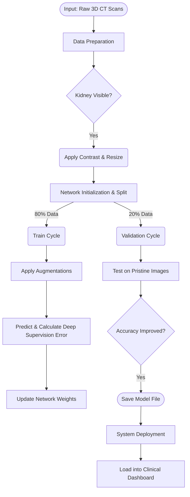

# Attention U-Net++: Kidney & Tumor Segmentation


## 🧬 Project Overview
This project implements a state-of-the-art **Attention U-Net++** architecture with **Deep Supervision** for precise kidney and tumor segmentation in abdominal CT scans. Using the **KiTS19** dataset, the model achieves a benchmark Dice Similarity Coefficient (DSC) of **0.9659**, rivaling high-tier competitive results.

### Key Features
- **Attention Gates:** Dynamically suppresses background noise and highlights target organ boundaries.
- **Deep Supervision:** Aggregates loss across multiple decoder depths for faster convergence and higher precision.
- **Efficient 2D Pipeline:** Optimized for clinical deployment with a lightweight (~39MB) model footprint.
- **Interactive Dashboard:** A Streamlit-based interface for real-time radiologist inference.

---

## 📊 Performance Benchmark
| Metric | Result |
| :--- | :--- |
| **Validation Dice Score** | **0.9659** |
| **Model Size** | 39.5 MB |
| **Training Epochs** | 50 (Optimized from 80) |
| **Inference Time** | < 1s (on CPU) |

---

## 🛠️ Technology Stack
- **Framework:** PyTorch
- **Augmentation:** Albumentations
- **Preprocessing:** NiBabel, OpenCV, NumPy
- **Deployment:** Streamlit
- **Environment:** Python 3.14 (macOS)

---

## 🚀 Getting Started

### 1. Installation
Clone the repository and install the dependencies:
```bash
git clone https://github.com/YOUR_USERNAME/test-project.git
cd test-project
source venv/bin/activate
pip install -r requirements.txt
```

### 2. Run the Dashboard
Ensure the `.pth` model weights are in the root directory, then run:
```bash
streamlit run app.py
```

---

## 📐 Algorithm & Architecture

### High-Level Workflow
1. **Preprocessing:** 3D CT volumes are sliced into 2D, filtered for kidney presence, and normalized to Hounsfield window [-100, 300].
2. **Augmentation:** Stochastic distortions (Affine, Elastic, Grid) are applied to the 80% training set.
3. **Architecture:** Data flows through a 5-level nested U-Net++ lattice with integrated Attention Gates.
4. **Optimization:** AdamW optimizer updates weights based on an aggregate Dice + BCE Loss with Deep Supervision weights [0.2, 0.3, 0.4, 1.0].
5. **Deployment:** The best-performing checkpoint (0.9659) is deployed via a Streamlit GUI.

### Pipeline Flowchart


---

## 📄 License
This project is licensed under the MIT License.
